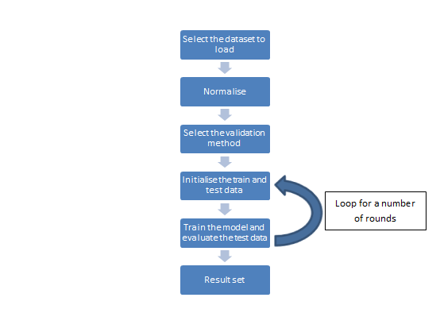

Sample Usage using dataset
==========================

Loading the dataset
-------------------

There are two different types of dataset. The MSR dataset contains skeletons and the Weizmann dataset contours of silhouettes. You can select which one will be loaded by changing the #define instruction at the beginning of the file. 

In the case of MSR, all skeletons are normalised and, in the case of Weizmann, we apply a radial summary to keep a certain amount of points of the contour.

Selecting the validation method
-------------------------------

Some basic validation methods are implemented such as "leave One Actor Out" or "2-Fold" and you can select which one will be executed by changing the #define instruction at the beginning of the file. 

Some definitions from Wikipedia.org : 
 
Leave One Out : https://en.wikipedia.org/wiki/Cross-validation_(statistics)#Leave-one-out_cross-validation  
2-Fold : https://en.wikipedia.org/wiki/Cross-validation_(statistics)#2-fold_cross-validation    

Result set
----------

A result set collects and computes the results of a validation (confusion matrix and average of successes).

Each validation round returns a result set forming part of the global result returned by each validation method.
So you can also print the result of each round.
