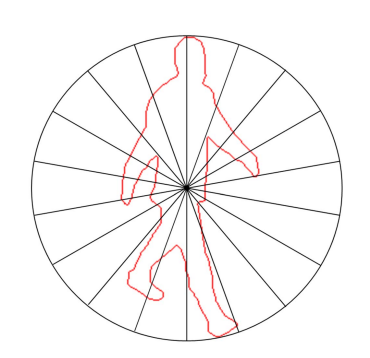

Here are two differents main functions. 
If you don't know how to select wich one is executed you can follow this explanation from microsoft : https://msdn.microsoft.com/en-us/library/x3eht538.aspx 

Sample Usage 1
==========================

This sample performs a validation on real datasets and give real validation results.

Here is a Simple diagram representing the process pipeline from the entry point to the results. 

Loading the dataset
-------------------

There are two different types of dataset. The MSR dataset contains skeletons and the Weizmann dataset contours of silhouettes. You can select which one will be loaded by changing the #define instruction at the beginning of the file. 

In the case of MSR, all skeletons are normalised and, in the case of Weizmann, we apply a radial summary to keep a certain amount of points of the contour.

Selecting the validation method
-------------------------------

Some basic validation methods are implemented such as "leave One Actor Out" or "2-Fold" and you can select which one will be executed by changing the #define instruction at the beginning of the file. 

Some definitions from Wikipedia.org : 
 
Leave One Out : https://en.wikipedia.org/wiki/Cross-validation_(statistics)#Leave-one-out_cross-validation  
2-Fold : https://en.wikipedia.org/wiki/Cross-validation_(statistics)#2-fold_cross-validation    

Result set
----------

A result set collects and computes the results of a validation (confusion matrix and average of successes).

Each validation round returns a result set forming part of the global result returned by each validation method.
So you can also print the result of each round.

Sample Usage 2
==========================

This sample contains three functions to understand the data type used for sequences and how to use it in simple cases.

1. The first one is the most basic example with simple parameters and a simple sequence of one RGB color.

2. The second one involves differents sources and weights in learnings parameters.

3. The last one shows a continuous recognition by changing the color during the sequence.